基于Springboot的宿舍管理系统（程序+论文）
=

### 完整代码获取地址：从戎源码网 ([https://armycodes.com/](https://armycodes.com/))
### 作者微信：19941326836  QQ：952045282 
### 承接计算机毕业设计、Java毕业设计、Python毕业设计、深度学习、机器学习
### 选题+开题报告+任务书+程序定制+安装调试+论文+答辩ppt 一条龙服务
### 所有选题地址https://github.com/nature924/allProject

一、项目介绍
---

基于 Spring Boot + Vue3 的宿舍管理系统，系统角色为 管理员（Admin）、宿管（DormManager） 和 学生（Student）。系统聚焦宿舍/床位管理、报修与调宿流程、公告与访客管理，主要功能如下：

管理员（Admin）
基本操作：登录、获取/修改个人信息、退出登录
用户/角色类管理：管理宿管账号（增删改查）、查看/修改管理员信息
楼宇/宿舍管理：楼宇与房间的增删改查、删除床位学生、检查房间/床位状态
学生管理：学生信息增删改查、按学号/用户名查询学生
公告管理：发布/编辑/删除/分页查询公告、首页公告获取
报修管理：发布/处理/删除/分页查询报修，报修统计
调宿申请：查看/审批调宿申请（审批通过会更新房间表）
访客管理：访客记录的增删改查
首页统计：学生总数、空宿舍数、已住宿人数、各楼人数、报修数量（用于图表展示）

宿管（DormManager）
基本操作：登录、获取/修改个人信息
公告管理：获取/发布/删除公告
学生与宿舍日常管理：查看/筛选学生、查看宿舍信息、参与报修处理与调宿审批
访客/报修/调宿：提交与处理对应记录（受权限约束）

学生（Student）
基本操作：登录、查看/修改个人信息
我的宿舍：查询本人宿舍信息
报修与调宿：发起报修、申请调宿

二、项目技术
---
- 编程语言：Java
- 数据库：MySQL
- 项目架构：B/S架构
- 前端技术：JSP
- 后端技术：Spring、SpringMVC、MyBatis

三、运行环境
---
- 操作系统：Windows、macOS都可以
- JDK版本：JDK1.8以上都可以
- 开发工具：IDEA、Ecplise、Myecplise都可以
- 数据库: MySQL5.7以上都可以
- Tomcat：任意版本都可以
- Maven：任意版本都可以

四、运行截图
---
### 论文截图：
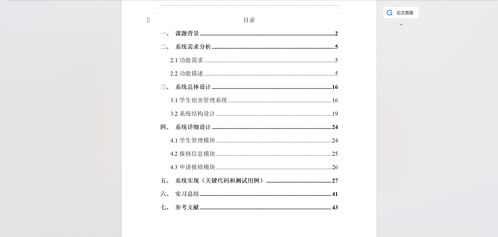
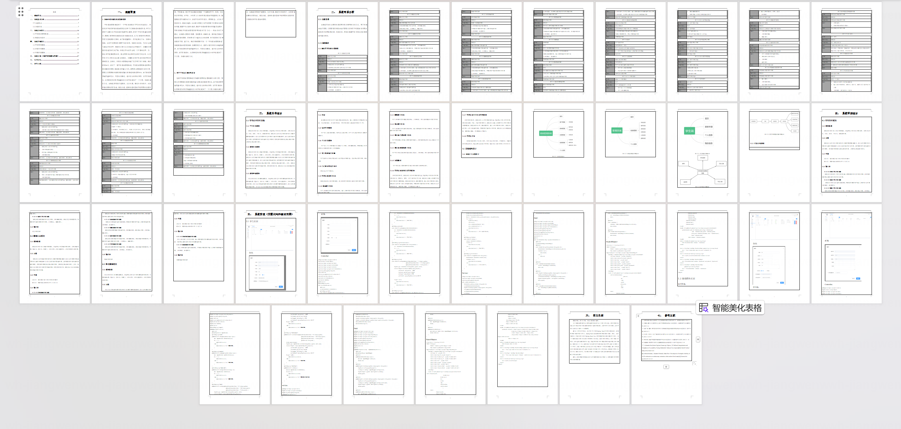

### 程序截图：
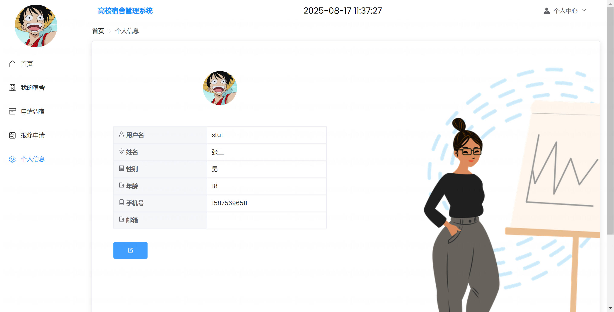
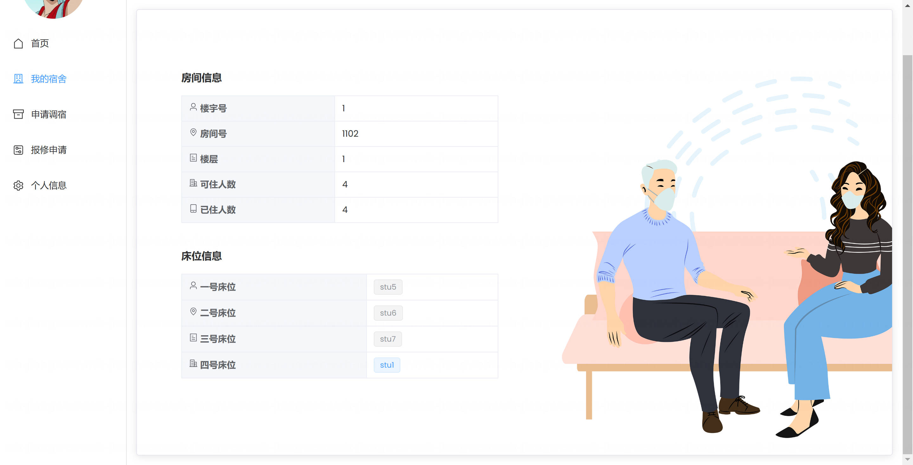
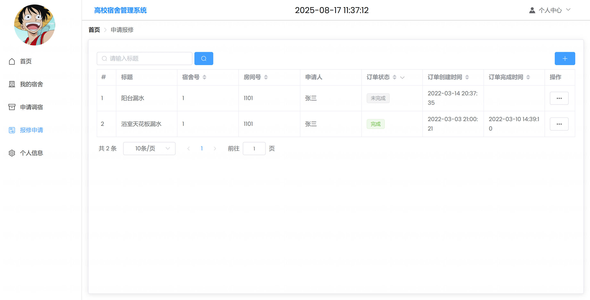
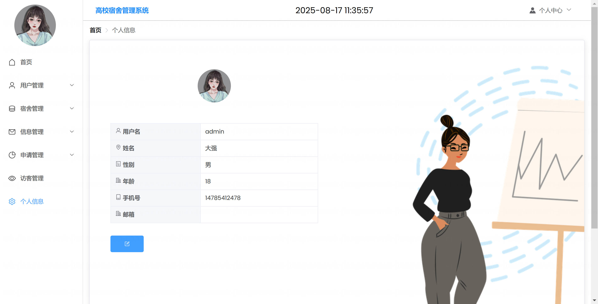
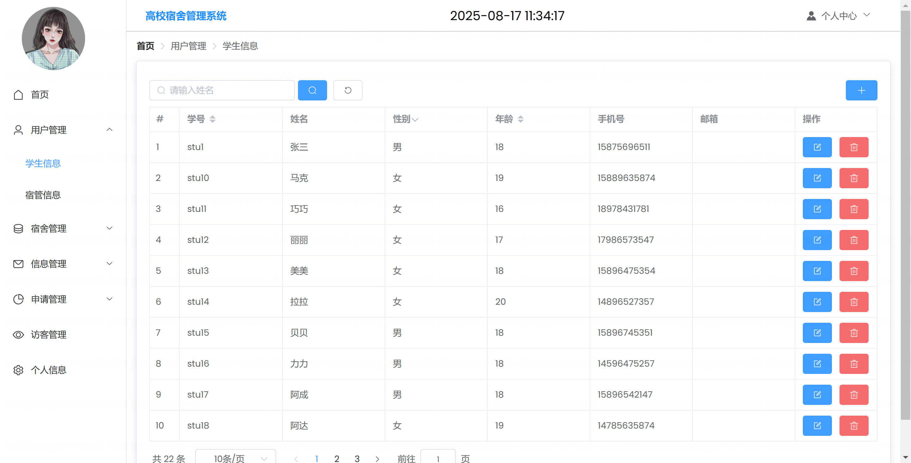
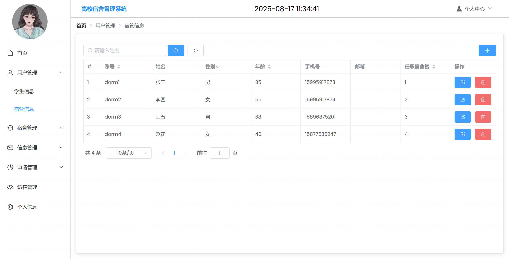
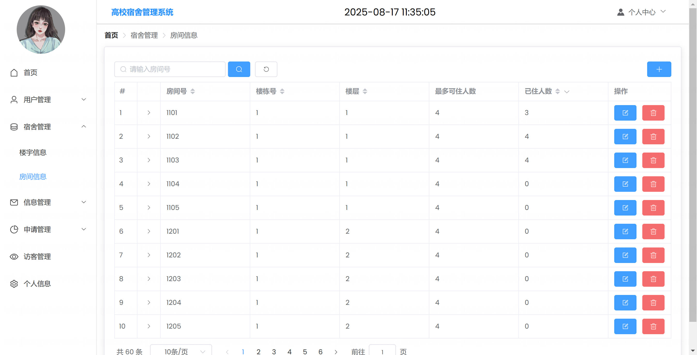
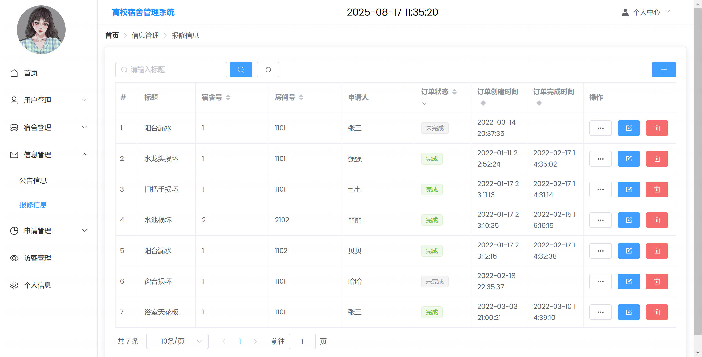
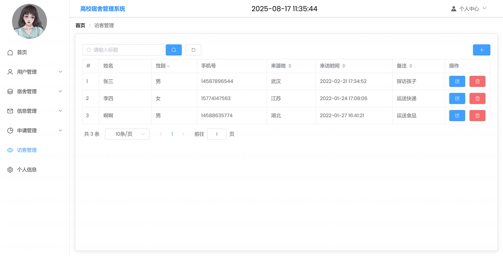

